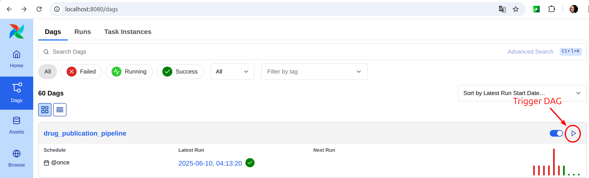
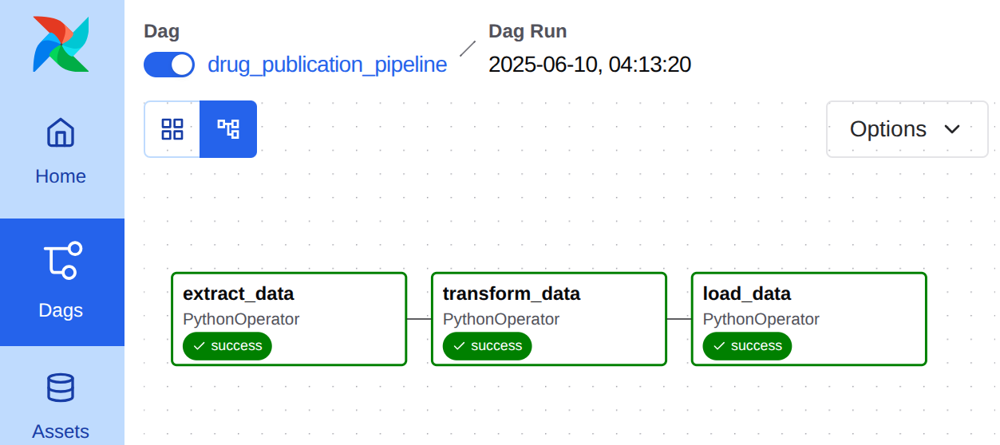
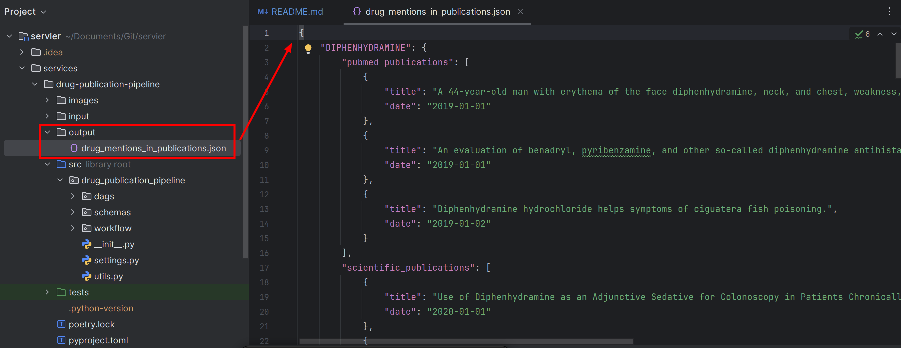

# drug-publication-pipeline

## Prerequisites
- Python 3.12
- [Poetry](https://python-poetry.org/docs/)
- [PyEnv](https://github.com/pyenv/pyenv)

## Installation

1. Clone Git repository
```bash
git clone https://github.com/youattara94/servier.git
```

2. Go to the service directory
```bash
cd servier/services/drug-publication-pipeline
```

3. Enable Python3.12 locally using PyEnv
```bash
pyenv local 3.12.4
```

4. Configure Poetry to use the local Python version
```bash
poetry env use python3.12
```
This command will also create and enable a virtual environment for the project if it doesn't already exist

5. Install dependencies
```bash
poetry env use python3.12
```
At the end of the installation, Poetry should display a message similar to:
```
Installing the current project: drug-publication-pipeline (0.1.0)
```

6. Initialize Airflow by running the following command:
```bash
poetry run airflow standalone
``` 
The login/password for the Airflow UI will be saved into a file. THe file path will be displayed on your console (usually `~/airflow/simple_auth_manager_passwords.json.generated`)  

7. To access the Airflow UI, open your web browser and go to `http://localhost:8080`. Use the credentials saved in the file from the previous step to log in.  

8. Update the path of the DAGs folder in the `airflow.cfg` file. Replace it with the path to the `dags` folder in your cloned Git repository  

9. Refresh the Airflow UI. You should see the `drug_publication_pipeline` DAG in the list of available DAGs.

10. To run the DAG, click on the toggle switch next to the DAG name in the Airflow UI. This will enable the DAG and allow it to run according to its schedule.  


11. Each of the 3 tasks in the DAG should run successfully and create a file `drug_publication_pipeline_output.json` in the `output` folder of the service directory. You can check the logs of each task in the Airflow UI to see their progress and results.


12. Overview of the output file:
  

Full content : 
```json
{
  "DIPHENHYDRAMINE": {
    "pubmed_publications": [
      {
        "title": "A 44-year-old man with erythema of the face diphenhydramine, neck, and chest, weakness, and palpitations",
        "date": "2019-01-01"
      },
      {
        "title": "An evaluation of benadryl, pyribenzamine, and other so-called diphenhydramine antihistaminic drugs in the treatment of allergy.",
        "date": "2019-01-01"
      },
      {
        "title": "Diphenhydramine hydrochloride helps symptoms of ciguatera fish poisoning.",
        "date": "2019-01-02"
      }
    ],
    "scientific_publications": [
      {
        "title": "Use of Diphenhydramine as an Adjunctive Sedative for Colonoscopy in Patients Chronically on Opioids",
        "date": "2020-01-01"
      },
      {
        "title": "Phase 2 Study IV QUZYTTIR™ (Cetirizine Hydrochloride Injection) vs V Diphenhydramine",
        "date": "2020-01-01"
      },
      {
        "title": "Feasibility of a Randomized Controlled Clinical Trial Comparing the Use of Cetirizine to Replace Diphenhydramine in the Prevention of Reactions Related to Paclitaxel",
        "date": "2020-01-01"
      }
    ],
    "journals": [
      {
        "journal": "Journal of emergency nursing",
        "date": "2020-01-01"
      },
      {
        "journal": "Journal of emergency nursing",
        "date": "2019-01-01"
      },
      {
        "journal": "The Journal of pediatrics",
        "date": "2019-01-02"
      }
    ]
  },
  "TETRACYCLINE": {
    "pubmed_publications": [
      {
        "title": "Tetracycline Resistance Patterns of Lactobacillus buchneri Group Strains.",
        "date": "2020-01-01"
      },
      {
        "title": "Appositional Tetracycline bone formation rates in the Beagle.",
        "date": "2020-01-02"
      },
      {
        "title": "Rapid reacquisition of contextual fear following extinction in mice: effects of amount of extinction, tetracycline acute ethanol withdrawal, and ethanol intoxication.",
        "date": "2020-01-01"
      }
    ],
    "scientific_publications": [],
    "journals": [
      {
        "journal": "Psychopharmacology",
        "date": "2020-01-01"
      },
      {
        "journal": "Journal of food protection",
        "date": "2020-01-01"
      },
      {
        "journal": "American journal of veterinary research",
        "date": "2020-01-02"
      }
    ]
  },
  "ETHANOL": {
    "pubmed_publications": [
      {
        "title": "Rapid reacquisition of contextual fear following extinction in mice: effects of amount of extinction, tetracycline acute ethanol withdrawal, and ethanol intoxication.",
        "date": "2020-01-01"
      }
    ],
    "scientific_publications": [],
    "journals": [
      {
        "journal": "Psychopharmacology",
        "date": "2020-01-01"
      }
    ]
  },
  "ATROPINE": {
    "pubmed_publications": [],
    "scientific_publications": [],
    "journals": []
  },
  "EPINEPHRINE": {
    "pubmed_publications": [
      {
        "title": "The High Cost of Epinephrine Autoinjectors and Possible Alternatives.",
        "date": "2020-02-01"
      },
      {
        "title": "Time to epinephrine treatment is associated with the risk of mortality in children who achieve sustained ROSC after traumatic out-of-hospital cardiac arrest.",
        "date": "2020-03-01"
      }
    ],
    "scientific_publications": [
      {
        "title": "Tranexamic Acid Versus Epinephrine During Exploratory Tympanotomy",
        "date": "2020-04-27"
      }
    ],
    "journals": [
      {
        "journal": "Journal of emergency nursing",
        "date": "2020-04-27"
      },
      {
        "journal": "The journal of allergy and clinical immunology. In practice",
        "date": "2020-03-01"
      },
      {
        "journal": "The journal of allergy and clinical immunology. In practice",
        "date": "2020-02-01"
      }
    ]
  },
  "ISOPRENALINE": {
    "pubmed_publications": [
      {
        "title": "Gold nanoparticles synthesized from Euphorbia fischeriana root by green route method alleviates the isoprenaline hydrochloride induced myocardial infarction in rats.",
        "date": "2020-01-01"
      }
    ],
    "scientific_publications": [],
    "journals": [
      {
        "journal": "Journal of photochemistry and photobiology. B, Biology",
        "date": "2020-01-01"
      }
    ]
  },
  "BETAMETHASONE": {
    "pubmed_publications": [
      {
        "title": "Clinical implications of umbilical artery Doppler changes after betamethasone administration",
        "date": "2020-01-01"
      },
      {
        "title": "Effects of Topical Application of Betamethasone on Imiquimod-induced Psoriasis-like Skin Inflammation in Mice.",
        "date": "2020-01-01"
      }
    ],
    "scientific_publications": [
      {
        "title": "Preemptive Infiltration With Betamethasone and Ropivacaine for Postoperative Pain in Laminoplasty or  Laminectomy",
        "date": "2020-01-01"
      }
    ],
    "journals": [
      {
        "journal": "Journal of back and musculoskeletal rehabilitation",
        "date": "2020-01-01"
      },
      {
        "journal": "Hôpitaux Universitaires de Genève",
        "date": "2020-01-01"
      },
      {
        "journal": "The journal of maternal-fetal & neonatal medicine",
        "date": "2020-01-01"
      }
    ]
  }
}
```